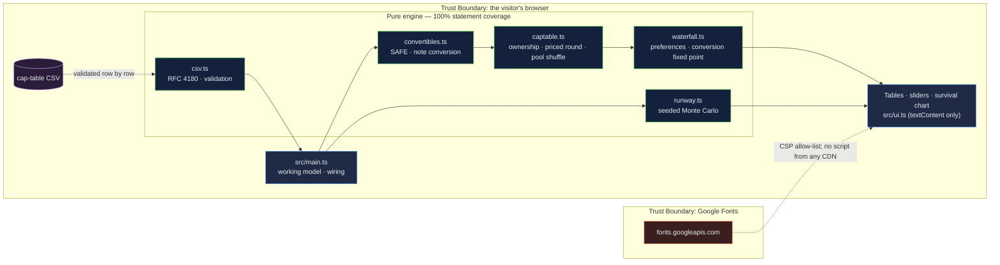

# Venture Finance Modeler: the dilution, conversion and waterfall arithmetic founders sign without running

[](https://github.com/Freddricklogan/venture-finance-modeler/actions/workflows/deploy.yml)
[](#5-getting-started--verification)
[](https://github.com/Freddricklogan/venture-finance-modeler/actions/workflows/codeql.yml)
[](LICENSE)
[](https://freddricklogan.github.io/venture-finance-modeler/)

## 1. Executive Summary & Business Impact

**Problem statement.** Founders sign SAFEs, notes and term sheets whose
arithmetic they have never run. A valuation cap is a discount they cannot
name; a "10% option pool" is paid for by them alone; a liquidation preference
decides who gets what at the exits that actually happen. The spreadsheet that
would show this is the one that never gets built, because the person who
needs it is the one without the finance background.

**Solution & value delivered.** A browser model of the whole chain: today's
cap table, SAFEs and a convertible note converting at the lower of cap and
discount, a priced round with a pre-money option pool, an exit waterfall
with liquidation preferences (participating or not), and a seeded Monte
Carlo runway that gives a P10/P50/P90 rather than one number. Every figure
is computed from editable inputs and every formula is tested against hand
arithmetic. The sample company is illustrative.

**[→ Read the full case study](docs/CASE_STUDY.md)**

| Outcome | How this repo delivers it |
| --- | --- |
| A SAFE's real price | `convertSafes()` takes the lower of cap price and discounted round price and reports which term won and the effective discount |
| The option-pool shuffle made visible | `applyPricedRound()` sizes a pre-money pool top-up to a post-money target and shows the price per share fall |
| Exit outcomes at the exits that happen | `waterfall()` pays preferences pro rata on a shortfall, converts non-participating preferred when that pays more, and lets participating take both |
| Runway as a distribution | `simulateRunway()` — seeded mulberry32, Box–Muller normals, percentiles and a survival curve, with a deterministic baseline beside it |
| Your cap table | CSV import with row-level validation; export of the post-round table |

## 2. Demonstrated Competencies & Technical Skills

- **Systems Architecture & CS** — strict TypeScript; five pure modules with
  the finance arithmetic isolated from rendering; a Vite build with no inline
  script so the strict CSP holds.
- **Data Science & AI** — a seeded Monte Carlo with a tested normal
  generator (mean and variance checked over 20,000 draws), percentile
  interpolation and a survival curve; the deterministic case is shown beside
  it so the reader can see what volatility adds.
- **Cybersecurity & Compliance** — strict CSP, no CDN scripts, validated CSV
  import, `textContent`-only rendering; typed ESLint, CodeQL and Trivy in CI.
- **EdTech & Human-Centered Design** — built to teach the mechanisms I
  learned in the Oxford Saïd venture-finance programme: every panel states
  its rule in one sentence, and the tour drags the exit to the point where
  the preferences bite.

## 3. System Architecture & Data Flow



## 4. Technical Highlights & Engineering Decisions

### ADR-1 — Post-money SAFEs convert against the pre-round fully diluted count

**Context.** The 2018 Y Combinator post-money SAFE defines the investor's
stake as investment ÷ cap, measured against the company's fully diluted
shares including all converting instruments. Pre-money SAFEs and notes use
subtly different bases, and most calculators pick one without saying.

**Decision.** `convertSafes()` computes the cap price as cap ÷ pre-round
fully diluted shares, compares it with the discounted round price, takes the
lower, and reports the basis. Notes accrue simple interest first. The
convention is stated on screen.

**Consequence.** A reader can check the arithmetic by hand: on the sample,
the $5M cap converts at $0.50 and the $0.91 round price makes that a 45%
discount — the number the founder should have known when signing.

### ADR-2 — Solve the conversion decision as a fixed point

**Context.** Whether a non-participating preferred holder converts depends
on what every other preferred holder does, because conversion changes the
common pool.

**Decision.** `waterfall()` iterates: each holder converts iff, given
everyone else's current choice, converting pays more than its preference;
repeat until no choice changes. Preferences are paid pro rata on a
shortfall.

**Consequence.** The low-exit and high-exit cases, the participating case,
a 2× multiple and a shortfall are each pinned by a test, and the total
always sums to the exit.

### ADR-3 — Seed the Monte Carlo and put the seed on the page

**Context.** A runway distribution that changes every time the page loads
cannot be discussed in a board meeting.

**Decision.** mulberry32 seeded from an input field; Box–Muller normals;
2,000 trials by default; the deterministic runway shown beside the
percentiles.

**Consequence.** Two people with the same inputs see the same P10, and a
test asserts that zero volatility collapses every trial to the deterministic
answer.

## 5. Getting Started & Verification

**Prerequisites.** Node 22 LTS.

```bash
git clone https://github.com/Freddricklogan/venture-finance-modeler.git
cd venture-finance-modeler
npm install
npm run dev        # http://localhost:5173/venture-finance-modeler/
npm run check      # lint → typecheck → validate → test → build
```

**Verification — the numbers this repository actually produced:**

```bash
npm test         # Test Files 5 passed (5) · Tests 31 passed (31)
npm run coverage # All files 100% statements · 90.15% branches
npm run lint     # eslint (typed) — clean
npm run typecheck# tsc --noEmit — clean
npm run validate # html-validate index.html — clean
npm run build    # dist: no inline script or style
```

| Check | Result |
| --- | --- |
| Unit tests | **31 passed / 31** across 5 files |
| Statement coverage (engine) | **100%** (branches 90.15%) |
| ESLint (type-checked), `tsc --noEmit`, html-validate | clean |
| Headless Chrome smoke (built site) | **0 console errors**; on the sample: round price $0.9135, 3,284,048 new shares, lead 20.0%, founders 48.7% post-round; $5M-cap SAFE converts at $0.50 (45.3% effective discount); at an $8M exit every preferred holder takes its preference and the lead takes 37.5%; pool top-up 0 raises the price to $1.044; runway P10 22.0 months, 56.7% survive 36 months on seed 42; no horizontal scroll at 400 px |

## 6. Live Demo & Production Showcase

**<https://freddricklogan.github.io/venture-finance-modeler/>**

No account, no backend. Sample company, labelled as such.

**30-second guided walkthrough.** Press **Take the 30-second tour**.

1. **Today and after the round** — the cap table before and after.
2. **What the SAFEs really cost** — conversion prices and effective discounts.
3. **The option-pool shuffle** — set the top-up to 0 and watch the price.
4. **Who gets what at exit** — drags the exit to $8M where preferences bite.
5. **Runway as a distribution** — 2,000 seeded trials, P10/P50/P90 and a
   survival curve.

Then edit any input, drag the exit slider, or import your own cap table.
